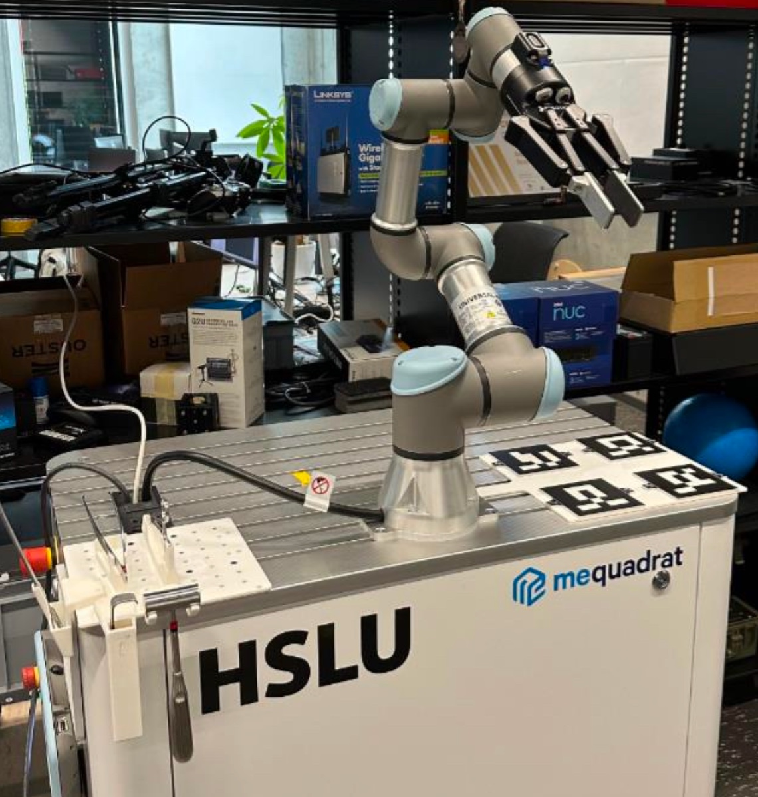

# Deployment Guide

## Robotic Scrub Nurse (UR3e)

This document describes how to deploy and run the Robotic Scrub Nurse system on a local workstation connected to a physical UR3e robot.

---

## 1. System Overview

The system consists of three main layers:

1. **Hardware drivers**
   - UR robot driver
   - Intel RealSense camera

2. **Motion planning backend**
   - MoveIt

3. **Application logic**
   - Hand tracking
   - Tool selection
   - Motion execution
   - Force-guided release

Runtime is started across dedicated terminals; multiple components can be grouped in one launch file.

---

## 2. Prerequisites

### Software

Required:

- Ubuntu 22.04 + ROS2 Humble
- colcon
- MoveIt 2
- Universal Robots ROS 2 Driver
- Intel RealSense SDK
- ALSA utils (`aplay`) for handover sound playback

### Python Dependencies

```bash
pip install mediapipe pyrealsense2 tabulate
```

---

## 3. Network Setup

The robot must be configured with a static IP address within the network settings.

### Robot Example Configuration

- Robot IP: 192.168.12.10
- Netmask: 255.255.255.0
- Gateway: 0.0.0.0

Update the IP address in the following files:
- `gripper_mover.py`
- `gripper_opener_with_zeroer.py`

Then update the robot IP in the launch command accordingly:

```bash
ros2 launch ur_robot_driver ur_control.launch.py ur_type:=ur3e robot_ip:=192.168.12.10 launch_rviz:=false
```

Use the following command to find your workstation's IP address:

```bash
ifconfig
```
Then, under `Installation` in the UR control panel, change the host IP according to the terminal output.

---

## 4. File Permissions

If scripts are not executable, grant permissions:

```bash
chmod +x src/tracking_pkg/src/publisher/camera_publisher.py
chmod +x src/tracking_pkg/src/publisher/frame_publisher.py
chmod +x src/tracking_pkg/src/publisher/gesture_pose_publisher.py
chmod +x src/tracking_pkg/src/hand_tracker/hand_tracker.py
chmod +x src/tracking_pkg/src/moveit_mover/gripper_mover.py
chmod +x src/tracking_pkg/src/moveit_mover/gripper_opener_with_zeroer.py
chmod +x src/tracking_pkg/src/publisher/tool_selection.py
chmod +x src/tracking_pkg/src/publisher/handover_sound_publisher.py
```

---

## 5. Physical Setup

Set up the hardware according to the system setup:



---

## 6. Startup Procedure

Start each component in a separate terminal, in the following order:

### Terminal 0 (once): Build + source workspace

```bash
cd ~/robotic_scrub_nurse_ws
colcon build --symlink-install
source /opt/ros/humble/setup.bash
source install/setup.bash
```

### Terminal 1: UR Hardware Driver

```bash
cd ~/robotic_scrub_nurse_ws
source /opt/ros/humble/setup.bash
source install/setup.bash
ros2 launch ur_robot_driver ur_control.launch.py \
  ur_type:=ur3e \
  robot_ip:=192.168.12.10 \
  launch_rviz:=false
```

Add `External Control` on the UR control panel and start the program.

Activate the robotiq gripper.

### Terminal 2: Tool Selector

```bash
cd ~/robotic_scrub_nurse_ws
source /opt/ros/humble/setup.bash
source install/setup.bash
ros2 run tracking_pkg tool_selection.py
```

### Terminal 3 (recommended): MoveIt + RViz + tracking loop

This starts:
- `ur_moveit_config` (without its default RViz)
- RViz with preloaded tracking displays
- TF visualization with directly visible frames (`camera_frame`, `aruco_board_frame`, and robot TCP frame)
- `tracking_pkg/loop_launch.py` (camera, frames, hand tracker, loop mover, sound node, ...)

```bash
cd ~/robotic_scrub_nurse_ws
source /opt/ros/humble/setup.bash
source install/setup.bash
ros2 launch tracking_pkg loop_with_moveit_launch.py \
  ur_type:=ur3e \
  tracking_rviz:=true
```

Optional: run the same command without RViz:

```bash
ros2 launch tracking_pkg loop_with_moveit_launch.py \
  ur_type:=ur3e \
  tracking_rviz:=false
```

### Optional split mode

Use this only if you intentionally want separate launches for MoveIt and tracking.

Terminal A:

```bash
ros2 launch ur_moveit_config ur_moveit.launch.py ur_type:=ur3e launch_rviz:=true
```

Terminal B:

```bash
ros2 launch tracking_pkg loop_launch.py
```

---
