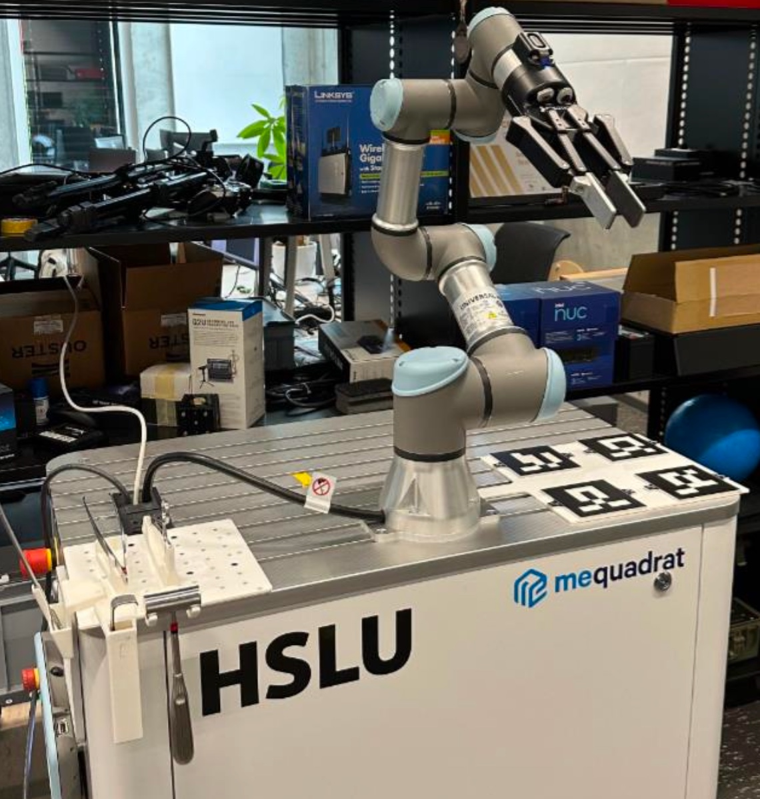

# Deployment Guide

## Robotic Scrub Nurse (UR3e)

This document describes how to deploy and run the Robotic Scrub Nurse system. The active runtime is
**distributed across two machines**:

- **NVIDIA Jetson Orin Nano** — perception + AI (cameras, detection, hand tracking, world model,
  speech-to-text, LLM orchestrator). Launch: `jetson_launch.py`.
- **Intel NUC** — robot control (UR driver, MoveIt, skill execution, gripper, RViz).
  Launch: `nuc_launch.py`.

Both machines share the same `ROS_DOMAIN_ID` over a wired `192.168.12.0/24` link using CycloneDDS in
unicast-only mode (per-machine configs `cyclone_dds_nuc.xml` / `cyclone_dds_jetson.xml`).

> To run everything on a single GPU machine (with the robot attached) instead of the two-machine
> split, skip to [Single-host mode](#9-single-host-mode) and use `llm_launch.py`.

See [ARCHITECTURE.md](ARCHITECTURE.md) for the full topology and interface contract.

---

## 1. System Overview

Three logical layers, mapped onto the two machines:

1. **Hardware drivers** — UR robot driver, 2× Intel RealSense D455 (NUC drives the robot; the Jetson
   drives the cameras).
2. **Motion planning backend** — MoveIt 2 (`move_group`) on the NUC.
3. **Application logic** — speech-to-text → LLM orchestrator → skill actions → MoveIt motion,
   plus hand tracking, world model, and force-guided release.

---

## 2. Prerequisites

### Software (both machines)

- Ubuntu 22.04 + ROS 2 Humble, colcon
- CycloneDDS (`ros-humble-rmw-cyclonedds-cpp`)

### NUC (robot control)

- MoveIt 2, Universal Robots ROS 2 Driver, `ur_moveit_config`
- ALSA utils (`aplay`) for handover sound playback (if the speaker is on the NUC)

### Jetson (perception + AI)

- Intel RealSense SDK + `realsense2_camera`
- JetPack / CUDA for YOLO GPU inference
- `OPENAI_API_KEY` in the environment (for the LLM orchestrator)

### Python Dependencies

```bash
# NUC
pip install ur_rtde tabulate
# Jetson
pip install mediapipe pyrealsense2 ultralytics torch pillow faster-whisper sounddevice openai
```

---

## 3. Required UR Description Overrides (NUC)

This project depends on two non-default `ur_description` overrides. Apply them on the **NUC** before
the first runtime start so the deployed robot model matches the tested thesis setup.

The canonical replacement files are stored in this repository:

- `~/robotic_scrub_nurse_ws/files/ur.urdf.xacro`
- `~/robotic_scrub_nurse_ws/files/joint_limits.yaml`

Recommended: back up the currently installed vendor files first.

```bash
sudo cp /opt/ros/humble/share/ur_description/urdf/ur.urdf.xacro \
  /opt/ros/humble/share/ur_description/urdf/ur.urdf.xacro.bak

sudo cp /opt/ros/humble/share/ur_description/config/ur3e/joint_limits.yaml \
  /opt/ros/humble/share/ur_description/config/ur3e/joint_limits.yaml.bak
```

Then copy the project-specific overrides into the installed `ur_description` package:

```bash
sudo cp ~/robotic_scrub_nurse_ws/files/ur.urdf.xacro \
  /opt/ros/humble/share/ur_description/urdf/ur.urdf.xacro

sudo cp ~/robotic_scrub_nurse_ws/files/joint_limits.yaml \
  /opt/ros/humble/share/ur_description/config/ur3e/joint_limits.yaml
```

- `ur.urdf.xacro` adds the project-specific tool cylinder to the UR description.
- `joint_limits.yaml` applies the tested UR3e joint constraints used by this project.

Warning: these overrides modify installed `ur_description` files under `/opt/ros/humble`. Reapply
them after ROS, `ur_description`, or UR driver updates, as package updates can overwrite them.

> Note: `nuc_launch.py` deliberately uses the **standard** `ur_moveit_config` bring-up. The vendored
> `rsn_ur_moveit.launch.py` / `rsn_ur.urdf.xacro` reference an old UR layout and are broken against
> UR driver 2.5/2.7 — do not use them.

---

## 4. Network Setup

### Robot

The UR controller must have a static IP reachable from the NUC. Example:

- Robot IP: 192.168.12.10, Netmask: 255.255.255.0, Gateway: 0.0.0.0

Under `Installation` on the UR control panel, set the host IP to the NUC's address. The gripper
control node reads the robot IP from the `UR_ROBOT_IP` environment variable.

### NUC ↔ Jetson DDS link

Both machines sit on the wired `192.168.12.0/24` switch and use unicast CycloneDDS:

```bash
# NUC
export CYCLONEDDS_URI=file://$HOME/robotic_scrub_nurse_ws/cyclone_dds_nuc.xml
export RMW_IMPLEMENTATION=rmw_cyclonedds_cpp
export ROS_DOMAIN_ID=<same on both machines>

# Jetson
export CYCLONEDDS_URI=file://$HOME/robotic_scrub_nurse_ws/cyclone_dds_jetson.xml
export RMW_IMPLEMENTATION=rmw_cyclonedds_cpp
export ROS_DOMAIN_ID=<same on both machines>
```

The configs pin the NUC to interface `192.168.12.5` and the Jetson to `192.168.12.6`. Verify
cross-machine discovery with `ros2 topic list` on each side after both launches are up.

---

## 5. File Permissions

If scripts are not executable, grant permissions (on the machine that runs them):

```bash
# Jetson
chmod +x src/tracking_pkg/src/perception/*.py \
         src/tracking_pkg/src/reasoning/*.py \
         src/tracking_pkg/src/llm/*.py \
         src/tracking_pkg/src/interfaces/*.py
# NUC
chmod +x src/tracking_pkg/src/execution/*.py \
         src/tracking_pkg/src/publisher/*.py
```

---

## 6. Physical Setup

Set up the hardware according to the system setup:



---

## 7. Build (both machines)

```bash
cd ~/robotic_scrub_nurse_ws
colcon build --symlink-install
source /opt/ros/humble/setup.bash
source install/setup.bash
```

---

## 8. Startup Procedure (distributed)

Bring up the machines in this order. Each terminal must first `source /opt/ros/humble/setup.bash`,
`source install/setup.bash`, and export the DDS env vars from [Section 4](#4-network-setup).

### NUC — Terminal 1: UR Hardware Driver

```bash
ros2 launch ur_robot_driver ur_control.launch.py \
  ur_type:=ur3e \
  robot_ip:=192.168.12.10 \
  launch_rviz:=false
```

On the UR control panel add `External Control` and start the program, then activate the Robotiq gripper.

### NUC — Terminal 2: Robot control stack (MoveIt + skill executor + RViz)

```bash
export UR_ROBOT_IP=192.168.12.10
ros2 launch tracking_pkg nuc_launch.py ur_type:=ur3e
```

Pass `tracking_rviz:=false` for a headless NUC (e.g. over SSH without a display).

### Jetson — Terminal 3: Perception + AI stack

```bash
export OPENAI_API_KEY=sk-...
ros2 launch tracking_pkg jetson_launch.py
```

Optional environment overrides: `RECLAIM_TRAY_CAM_SERIAL`, `TRAY_CAM_SERIAL`, `OBB_MODEL_PATH`,
`OBB_DEVICE` (default `cuda:0`). Heavy model loads are staggered on boot; give the Jetson ~15 s to
settle before speaking.

### Operate

Speak a command into the Samson USB microphone (e.g. *"give me the scissors"*). The LLM publishes a
terse status on `/system_response`. Without a microphone you can inject commands manually:

```bash
ros2 topic pub --once /user_speech std_msgs/msg/String "{data: 'give me the scissors'}"
```

The robot picks the tool, presents it, waits for the surgeon's `double_open_close` gesture, moves to
the hand, and releases on a force tug.

---

## 9. Single-host mode

To run the whole graph on one GPU machine with the robot attached (no NUC/Jetson split):

```bash
# Terminal 1: UR driver
ros2 launch ur_robot_driver ur_control.launch.py ur_type:=ur3e robot_ip:=192.168.12.10 launch_rviz:=false
# Terminal 2: everything else (perception + AI + robot control)
export OPENAI_API_KEY=sk-...
ros2 launch tracking_pkg llm_launch.py ur_type:=ur3e
```

---
